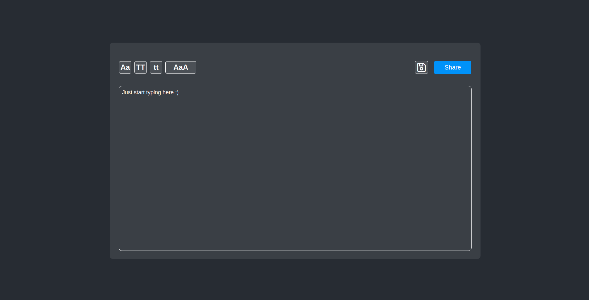

# Online Notepad

Online Notepad webapp made with ReactJS.

## Getting started

Clone this repo.

```bash
git clone https://github.com/jpssantiago/onlinenotepad
```

Install dependencies

```bash
yarn
(or npm i)
```

Enjoy :)

```bash
yarn start 
(or npm start)
```

## Images



## License
[MIT](LICENSE)
